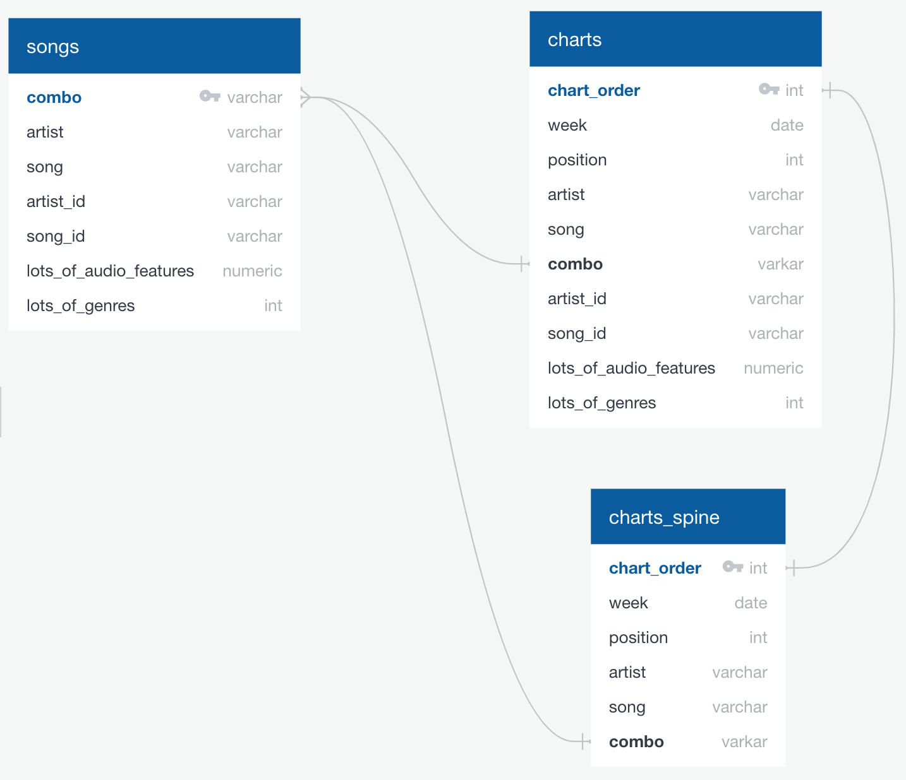

# Audio Feature Analysis


## Overview 

Here, I used archived American Top 40 singles charts merged with Spotify audio and genre data to characterize variation in American 
popular music. Generally, I was guided by the question "How do American Top 40 songs vary?" To address this broad question, I used
k-means clustering models to visualize patterns of variation in both genres and audio features across a sample of hit music singles.

## Methods

### 1. Data scraping

I scraped weekly USA Top 40 singles charts from [Top40-Charts.com](https://top40-charts.com/), ranging from the week of July 7, 1997
to October 15, 2022. For each week, I recorded all 40 song titles, their chart positions, and their artists as listed online. I used
Beautiful Soup in Jupyter Notebooks to extract all data. Raw code for this step is in the file ```01_APIs/top40_web_scraping.ipynb```
and raw data in the file ```00_data/top40_1997_2022_raw.csv```. After some cleaning to remove formatting issues and featured artists,
this set of songs is referred to as the 'chart spine' to which audio and genre data are to be merged. Because many songs occur repeatedly
in the charts dataset (at different chart positions over time), this dataset was also reduced into the set of all unique songs, referred to
as the 'songs' dataset.

### 2. Spotify data

I collected audio features and genre data for all songs in the 'songs' dataset using the 
[Spotify Web API](https://developer.spotify.com/documentation/web-api/). The Spotify Web API does not have a method to search directly for 
a specific song title by an artist, so I conducted a series of consecutive API calls to get song-specific data for this dataset. All calls are 
made within the ```get_top40_features``` function in the file ```01_APIs/get_top40_audio_features.ipynb```. The API calls work as follows:

1. Artist search
- I used an 'item' search to search for a given chart artist by name. In case the artist of interest shared a common name with another artist,
I returned five artists per search to ensure I could find the desired artist within the set of five. 

2. Top Tracks search
- I used a 'top tracks' search to find the most popular songs from all artists from each artist search. Spotify does not allow searching for tracks
by title, so a direct search for tracks of interest is impossible. Luckily, because the chart spine dataset represents a set of highly popular
songs, a top tracks search is a reliable way to find chart tracks of interest. This search returns an artist's 20 most popular songs. For each
charted song in the 'songs' dataset, this produced a list of 5 (artist search) x 20 (top tracks search) = 100 potential tracks from which to extract
audio and genre data. 
- From this list, I searched for a song title that matched the charted title of interest. When I found the correct song, I saved Spotify's
specific URI identifiers for that track and artist.

3. Audio Features search
- For each track URI, I used a 'track's audio features' search in the Spotify Web API. This search returns Spotify's scores for different 
categories of audio features. These are (using [Spotify's descriptions](https://developer.spotify.com/documentation/web-api/reference/#/operations/get-audio-features)):

	- acousticness: A confidence measure from 0.0 to 1.0 of whether the track is acoustic. 1.0 represents high confidence the track is acoustic.
	- duration: The duration of the track in milliseconds.
	- danceability: How suitable a track is for dancing based on a combination of musical elements including tempo, rhythm stability, beat strength, and overall regularity. A value of 0.0 is least danceable and 1.0 is most danceable.
	- energy: A measure from 0.0 to 1.0 and represents a perceptual measure of intensity and activity. Typically, energetic tracks feel fast, loud, and noisy. For example, death metal has high energy, while a Bach prelude scores low 
	on the scale. Perceptual features contributing to this attribute include dynamic range, perceived loudness, timbre, onset rate, and general entropy.
	- instrumentalness: Predicts whether a track contains no vocals. "Ooh" and "aah" sounds are treated as instrumental in this context. Rap or spoken word tracks are clearly "vocal". The closer the instrumentalness value is to 1.0, 
	the greater likelihood the track contains no vocal content. Values above 0.5 are intended to represent instrumental tracks, but confidence is higher as the value approaches 1.0.
	- key: The key the track is in. Integers map to pitches using standard Pitch Class notation. E.g. 0 = C, 1 = C♯/D♭, 2 = D, and so on. If no key was detected, the value is -1.
	- liveness: Detects the presence of an audience in the recording. Higher liveness values represent an increased probability that the track was performed live. A value above 0.8 provides strong likelihood that the track is live.
	- loudness: The overall loudness of a track in decibels (dB). Loudness values are averaged across the entire track and are useful for comparing relative loudness of tracks. Loudness is the quality of a sound that is the 
	primary psychological correlate of physical strength (amplitude). Values typically range between -60 and 0 db.
	- mode: Indicates the modality (major or minor) of a track, the type of scale from which its melodic content is derived. Major is represented by 1 and minor is 0.
	- speechiness: Detects the presence of spoken words in a track. The more exclusively speech-like the recording (e.g. talk show, audio book, poetry), the closer to 1.0 the attribute value. Values above 0.66 describe tracks that are 
	probably made entirely of spoken words. Values between 0.33 and 0.66 describe tracks that may contain both music and speech, either in sections or layered, including such cases as rap music. Values below 0.33 most likely represent 
	music and other non-speech-like tracks.
	- tempo: The overall estimated tempo of a track in beats per minute (BPM). In musical terminology, tempo is the speed or pace of a given piece and derives directly from the average beat duration.
	- time signature: An estimated time signature. The time signature (meter) is a notational convention to specify how many beats are in each bar (or measure). The time signature ranges from 3 to 7 indicating time signatures of "3/4", to "7/4".
	- valence: A measure from 0.0 to 1.0 describing the musical positiveness conveyed by a track. Tracks with high valence sound more positive (e.g. happy, cheerful, euphoric), while tracks with low valence sound more negative (e.g. sad, depressed, angry).

4. Genre search
- For each chart track, I used the artist's Spotify URI to conduct an 'artist' search. This search returns lots of different data, from which I extracted only
the list of genres associated with that artist. 

I saved all Spotify data into the 'songs' dataset for downstream analyses.

### 3. SQL database

I uploaded the complete 'songs' dataset and the 'charts spine' into pgAdmin 4, then performed an outer join using PostgreSQL to bind Spotify audio and genre
data onto the charts spine. This produced the complete 'charts' dataset, which includes all chart instances for all songs, plus Spotify data for each instance.
The ERD for the database is visible here:


### 4. Machine learning models

I conducted a series of k-means cluster analyses to characterize variation in the 'songs' dataset. All models are in the file ```04_models/01_kmeans_songs.ipynb```.
Prior to analyses, I categorized all Spotify genres (referred to here as subgenres) into broad genre categories for 'pop', 'rock', 'hip-hop', and 'other'. I also
binned all songs identified as some form of 'metal' out of curiosity to find metal in the Top 40 singles charts. I additionally used Ariana's subset of the 
top 50 most common subgenres in the dataset. Briefly, I reduced the dimensionality of each data subset prior to k-means analyses, and modeled 
variation in the following datasets:

- all audio and subgenre features in the full 'songs' dataset
- all audio features in the full dataset
- all subgenres in the full dataset
- all audio features in the top 50 subgenres
- all subgenres in the top 50 subgenres
- all audio features in the set of broad genres (pop + rock + hip-hop + metal)
- all genres in the set of broad genres

Because models didn't separate genres by audio features particularly well, I followed up with one final model to see if all songs by artists categorized as 'metal'
could be distinguished from songs by artists categorized as 'dance pop'. 

## Results